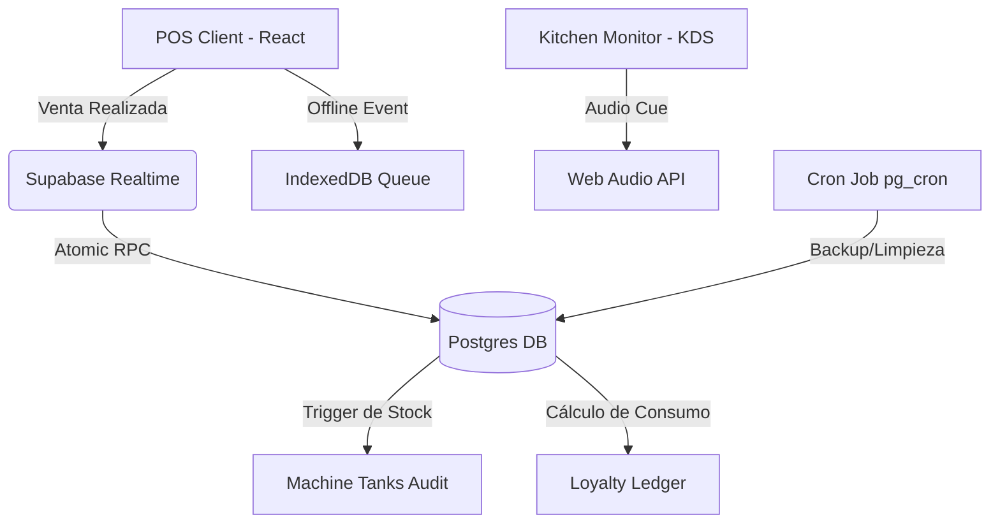

# Análisis Técnico, Funcional y de Experiencia (UI/UX/CX)
**Proyecto:** Pekao Granizados POS  
**Consultoría Profesional de Arquitectura y Diseño**

---

## 1. Análisis Técnico de la Arquitectura

El sistema de **Pekao Granizados** cuenta con una arquitectura moderna y robusta, diseñada para operar en entornos físicos con conectividad variable. A continuación se desglosan sus pilares técnicos:

### A. Capa de Frontend e Interactividad
*   **Vite + React + TypeScript:** Permite un tiempo de compilación ultrarrápido y un tipado fuerte que previene errores fatales en tiempo de ejecución (especialmente al realizar conversiones de volumen o cálculos financieros).
*   **TanStack Query (React Query):** Administrador de estado del servidor altamente eficiente. Permite almacenar en caché local las peticiones a Supabase, logrando una carga instantánea y previniendo colisiones de red.
*   **Framer Motion:** Maneja las micro-interacciones de la interfaz. Tras las optimizaciones aplicadas, opera mediante `layout="position"`, reduciendo significativamente los recálculos de flujo en pantalla (reflows) durante búsquedas rápidas.

### B. Capa de Datos y Concurrencia (Supabase / PostgreSQL)
*   **Seguridad y Aislamiento por RLS (Row Level Security):** Las tablas están protegidas a nivel de base de datos. Las consultas del frontend están acotadas a la sesión del usuario y a la tienda asociada (`store_id`).
*   **Procedimientos de Base de Datos Atómicos (RPC):**
    *   `process_sale`: Encapsula toda la creación de la venta y deducción de inventario en una única transacción de base de datos.
    *   `update_order_with_stock`: Permite modificar una orden existente, devolviendo primero el inventario anterior y descontando el nuevo de forma atómica.
    *   `cancel_sale_with_stock_restore`: Permite anular ventas restaurando completamente el inventario (tanto unidades como mezclas) de forma segura.
*   **Prevención de Colisiones de Stock (`FOR UPDATE`):** Las funciones usan bloqueos de fila (`FOR UPDATE`) para evitar condiciones de carrera (Race Conditions). Si dos terminales venden la última porción de granizado al mismo tiempo, el motor de base de datos procesa una secuencialmente y rechaza la otra de forma controlada.

### C. Estrategia Offline-First (IndexedDB)
*   **OfflineService.ts:** Actúa como un middleware local. Si se pierde la conexión de red:
    1. Las ventas se encolan localmente en IndexedDB.
    2. La UI pasa automáticamente a modo `OFFLINE`, advirtiendo al cajero pero permitiendo que siga operando de manera fluida.
    3. Una vez se detecta de nuevo conectividad, el POS sincroniza las transacciones pendientes mediante la API RPC de Supabase.

---

## 2. Análisis Funcional

### A. Modelo de Inventario Dual (El "Problema de la Mezcla")
El negocio de granizados presenta un reto logístico clásico: los insumos líquidos de las máquinas se compran en volumen (mililitros/litros), pero se venden en unidades discrecionales combinadas (vasos de diferentes tamaños, adicionados con toppings). El sistema soluciona esto de manera elegante:
1.  **Stock Físico (Vaso/Toppings):** Deducción simple de unidades discrecionales en `store_stock`.
2.  **Volumen de Mezcla (Tanques):** Las recetas configuran un consumo en mililitros (`ml`). La fórmula de base calcula:
    $$\text{Deducción (ml)} = \text{Volumen Base (Oz)} \times \text{Multiplicador de Tamaño} \times 29.57\text{ (Conversión a ml)}$$
    Esto permite descontar exactamente el volumen líquido consumido del tanque de la máquina correspondiente de forma automática.

### B. Ciclo de Turnos de Caja (Gating de Operaciones)
El sistema implementa un control de caja estricto:
*   Para realizar ventas en el POS, el cajero debe iniciar un turno activando una base de caja (`open_turn`).
*   Se admite el estado pausado (`paused`) de turnos para cierres temporales de seguridad.
*   Previene múltiples turnos abiertos simultáneamente para el mismo empleado o caja, garantizando la trazabilidad contable.

---

## 3. Diagnóstico y Estado de Sugerencias de UI, UX y CX

### 🎨 A. Interfaz Gráfica (UI - User Interface)

*   **1. Indicador Visual del Nivel de Tanques en POS**
    *   **Estado:** **[COMPLETADO - IMPLEMENTADO]**
    *   *Detalles:* Se diseñó un componente 3D glassmorphic (`TankLevelIndicator.tsx`) en la barra lateral del POS que muestra en tiempo real el porcentaje y color degradado del nivel estimado de cada tanque de mezcla de la máquina, con actualizaciones reactivas y opción de inicialización para administradores y propietarios.
*   **2. Contraste de Modos Táctiles (Modo Alto Contraste / Modo Día)**
    *   **Estado:** *Pendiente*
    *   *Sugerencia:* Aunque el tema oscuro nativo es ideal para interiores de tiendas, la luz solar directa en quioscos o locales abiertos puede dificultar la visualización. Proporcionar un selector rápido de contraste optimizado para exteriores mejorará notablemente la usabilidad.
*   **3. Alertas de Stock Crítico Más Distintivas (Glow Pulse)**
    *   **Estado:** **[COMPLETADO - IMPLEMENTADO]**
    *   *Detalles:* Se inyectaron animaciones CSS en `index.css` (`@keyframes border-glow-pulse`) que hacen pulsar rítmicamente en color ámbar las tarjetas con stock bajo en el POS y en color rojo en el almacén de inventario. Se añadieron también badges e indicadores animados localizados (`animate-pulse`) para guiar la vista del cajero inmediatamente.

---

### ⚙️ B. Experiencia de Usuario (UX - User Experience)

*   **1. Panel Flotante de Atajos de Teclado (Cheat Sheet)**
    *   **Estado:** *Pendiente*
    *   *Sugerencia:* Aunque existen atajos configurados (`⌘ K`, etc.), muchos operarios los desconocen. Agregar un modal interactivo muy visual al pulsar `?` facilitará la curva de aprendizaje de los nuevos cajeros.
*   **2. Modo de Personalización Rápida de Productos (Quick Customize)**
    *   **Estado:** **[COMPLETADO - IMPLEMENTADO]**
    *   *Detalles:* Se eliminó el flujo con ventanas emergentes completas de personalización al hacer clic en los granizados. Ahora se cargan instantáneamente en el carrito y se personalizan directamente allí: selector de tamaños ("pills" inline) y selector de toppings mediante Popovers de Radix UI con badges interactivos que permiten la remoción rápida con un clic (`×`).
*   **3. Optimización de la Pantalla de Preparación (Kitchen Display System - KDS)**
    *   **Estado:** *Pendiente*
    *   *Sugerencia:* Implementar sonidos discretos de notificación web (Web Audio API) cada vez que llegue un nuevo pedido al área de preparación, evitando que el operario tenga que vigilar la pantalla constantemente durante las horas pico.

---

### 🤝 C. Experiencia del Cliente (CX - Customer Experience)

*   **1. Módulo Habeas Data Integrado con Firma Digital Táctil**
    *   **Estado:** *Pendiente*
    *   *Sugerencia:* El proyecto ya cuenta con campos de Habeas Data para CRM. Al registrar un nuevo cliente, habilitar una ventana de firma rápida en tabletas o pantallas táctiles para que el cliente firme el consentimiento con el dedo, guardándolo de forma segura.
*   **2. Impresión de Recibos Personalizada (CX Branding)**
    *   **Estado:** *Pendiente*
    *   *Sugerencia:* Ofrecer plantillas dinámicas de tickets térmicos donde se pueda imprimir no solo el logotipo optimizado del negocio, sino también un código QR dinámico de satisfacción o una promoción personalizada basada en sus compras pasadas.
*   **3. Indicador de Fidelización en Pantalla (Loyalty Badges)**
    *   **Estado:** *Pendiente*
    *   *Sugerencia:* Mostrar en el flujo de pago un mensaje visible para el cliente (o para el cajero al ingresar los datos del cliente) que indique cuántos granizados le faltan para su siguiente recompensa gratuita.

---

## 4. Propuestas de Innovación (Idea to Action)

A continuación, se estructura una propuesta de evolución a nivel de arquitectura y producto para maximizar el valor comercial de la plataforma:

### Phase 1: El Resumen del Fundador
Pekao Granizados POS requiere evolucionar de un sistema transaccional de punto de venta a un **sistema integrado de automatización operativa y fidelización inteligente**. El objetivo es reducir costos por desperdicio de mezcla líquida y maximizar la retención de clientes mediante gamificación, sin incrementar la carga de hardware en las tiendas físicas.

### Phase 2: Arquitectura del Sistema Propuesto

### Phase 3: Plan de Ejecución

#### 1. Pasos de Acción Inmediatos
- [ ] **Frontend - Audio KDS:** Implementar un sintetizador de audio nativo (Web Audio API) en la pantalla de cocina que alerte sonoramente cada vez que cambie el estado de un pedido.
- [ ] **Frontend - Widget Offline:** Diseñar un cajón de sincronización (`SyncDrawer`) que permita a los cajeros ver cuántas ventas están encoladas y forzar la sincronización.
- [ ] **Backend - Historial de Auditoría:** Crear una tabla `security_audit_logs` que registre de forma inmutable todas las operaciones de inicialización o ajuste manual de tanques por parte de administradores.
- [ ] **Backend - Automatización pg_cron:** Configurar un script de mantenimiento que comprima y depure logs antiguos del POS para mejorar la velocidad de lectura en bases de datos de alta transaccionalidad.

#### 2. Cronograma Estimado
*   **Día 1:** Prototipo del módulo de fidelización en base de datos (Esquema de puntos y triggers).
*   **Día 2:** Integración de alertas sonoras en KDS y visualizador de cola offline en frontend.
*   **Día 3:** Pruebas de resistencia offline, simulación de cortes de red y auditoría de sincronización.
*   **Día 4:** Despliegue de triggers de mantenimiento de logs y backups automatizados.

#### 3. Análisis de Riesgos
*   **Riesgo Técnico:** La Web Audio API puede requerir interacción previa del usuario (un clic inicial) en el navegador debido a políticas de autoplay.
    *   *Mitigación:* Añadir un botón flotante decorativo de activación de audio ("Habilitar Sonido") al entrar a la pantalla del KDS.
*   **Riesgo de Producto:** El sistema de puntos/fidelización puede ralentizar el cierre de ventas si requiere demasiada interacción del cajero.
    *   *Mitigación:* Hacer que la lectura del número celular del cliente en la ventana flotante asocie los puntos de forma 100% silenciosa en segundo plano.

---

### Explicación Multinivel (Multilevel Explanations)

#### El Pitch (ELI5 / Inversionista)
> Imagina una heladería donde los cajeros pueden registrar ventas incluso si se corta la luz o el internet. El sistema sabe cuántos litros de granizado le quedan a cada máquina en tiempo real y hace sonar una alarma en la cocina cada vez que hay una orden nueva. Además, premia a los clientes fieles dándoles puntos automáticamente en su celular. Esto evita desperdicios de helado y hace que la gente regrese siempre por más.

#### Las Especificaciones (Técnicas)
> El sistema se basa en una arquitectura reactiva cliente-servidor. El estado local del cliente utiliza `TanStack Query` parametrizado con un `staleTime` agresivo de 2 segundos, combinado con suscripciones persistentes mediante canales de WebSockets en `Supabase Realtime`. Si ocurre una desconexión, un service worker almacena las peticiones HTTP en una tienda de objetos transaccionales `IndexedDB`. Las operaciones de base de datos están protegidas mediante procedimientos almacenados con aislamiento `SERIALIZABLE` o bloqueos selectivos `FOR UPDATE` para garantizar la integridad ACID durante accesos simultáneos a las tablas críticas del negocio.
